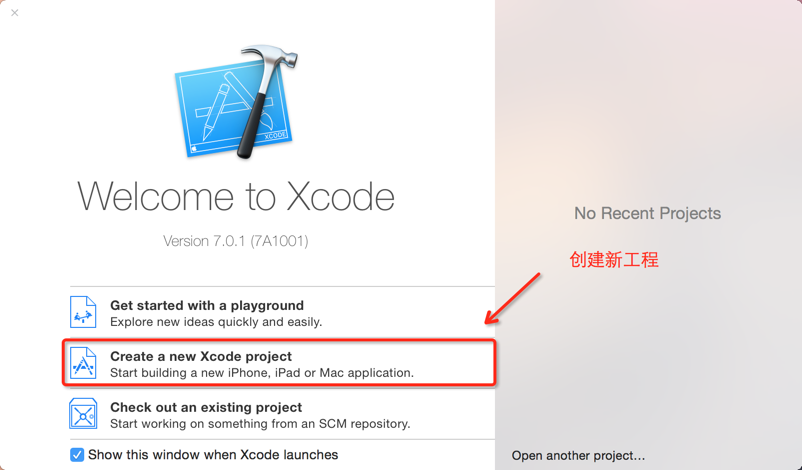
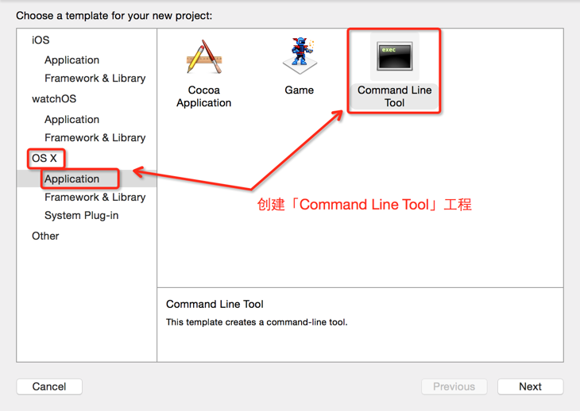
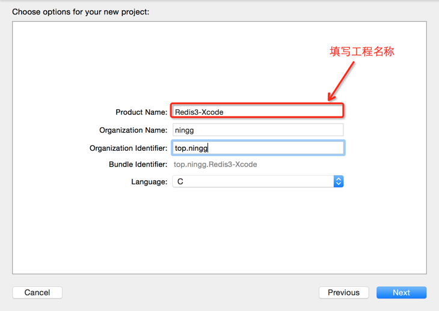
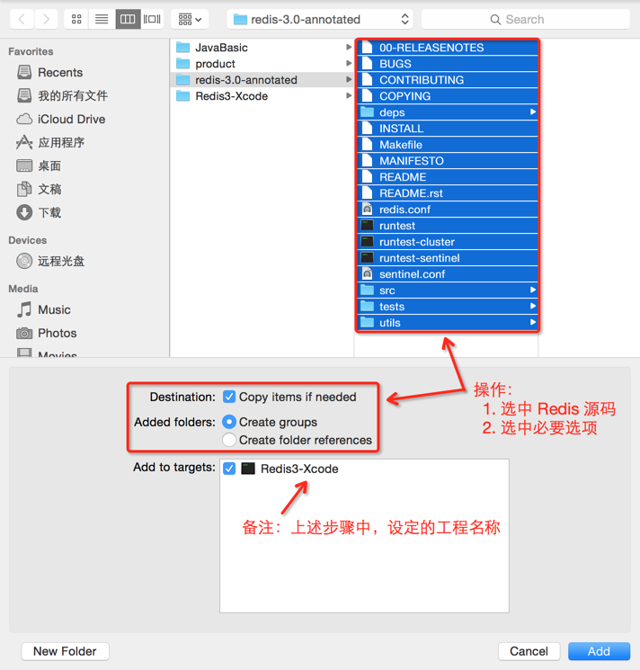

# Redis3-Xcode
Xcode下查看 Redis3 的源码

具体操作：

**1.Create a New Project**

**2.「OS X」--「Application」–「Command Line Tool」，填写必要信息，即可创建一个「Command Line Tool」工程**

**3.在上述工程下：「File」–「Add Files to...」– 参考下面截图**

到此，即可在Xcode下查看Redis的源码了。

## Xcode快捷键

查看代码

|快捷键|说明|备注|
|:--|:--|:--|
|cmd + shift + O|按 struct 名称、文件名称，查询||

更多细节，参考：

* [Redis 设计与实现：使用Xcode 查看 Redis 源码](http://ningg.top/redis-lesson-2-source-code-review-in-xcode/)

## 参考来源

* [https://github.com/antirez/redis/issues/2009]
* [Build Makefile Projects with Xcode]

[https://github.com/antirez/redis/issues/2009]:    https://github.com/antirez/redis/issues/2009
[Build Makefile Projects with Xcode]:    http://daozhao.goflytoday.com/2014/02/%E4%BD%BF%E7%94%A8xcode%E5%8E%BB%E5%BC%80%E5%8F%91makefile%E7%9A%84projectbuilding-makefile-projects-with-xcode/
